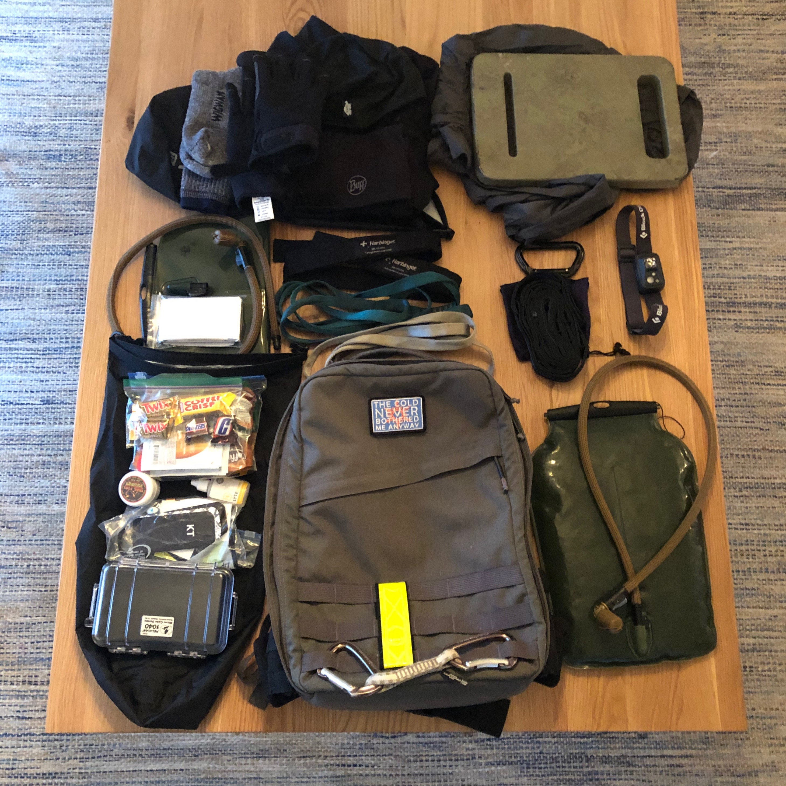

One of the few things you can control when attempting a [GORUCK HTL](https://www.goruck.com/htl/) is your gear. Some of the items you’ll want are obvious and will be listed on the official event packing lists GORUCK provides, but if an HTL is one of your first GORUCK experiences[^1] and/or you haven’t done cold-weather events, this list might help you figure out what additional gear you'll need. 

In November 2018, I successfully completed my first HTL during Veterans Day weekend in Indianapolis. At the start of the event, the temperature was in the low 30s and dropped to 19F in the wee morning hours of the Heavy. For most of the weekend, the temperature mostly stayed in the 30s, with a few hours of low 40s. Precipitation-wise, there were a few mild flurries the first night, but nothing too serious. 

The following is a description of my gear, both worn and carried, during the weekend I earned my bolts. 

 

## The ruck

First things first: the ruck. I’ve used both a [standard 26L GR1 and a 21L GR1](https://www.goruck.com/rucksacks/shop-all-rucksacks/) for events.[^2] I’m 5’11" and the 26L is *just slightly* too long on my torso and I’ve found that the 21L is just more comfortable for me. 

I’ve added a GORUCK [sternum strap](https://www.goruck.com/molle-sternum-strap/) and [hip belt](https://www.goruck.com/padded-hip-belt/), which for me are non-negotiable items for an HTL. Not only will it help re-distribute the weight in your ruck, the hip belt will prevent your ruck from sliding into the back of your head/neck during the inevitable bear crawl. 

On the front MOLLE of my ruck, I’ve got a [Black Diamond Quickdraw](https://www.amazon.com/gp/product/B004M3DXX2/ref=ppx_yo_dt_b_asin_title_o08__o00_s00?ie=UTF8&psc=1) that acts as another handle. It comes in handy while doing presses and overhead holds. This addition isn’t needed if you have a Rucker 2.0 with the second handle already sewn into the bottom of the ruck.

Also, a reflective band. It’s required. 

And a morale patch. Because of Rule #1.[^3] 

## Inside the ruck: laptop compartment

I have a 28 pound steel plate from the now-defunct SH Plates for the Heavy/Tough and a 20 pound plate from GORUCK for the Light. If you’re using a GR1 or a Rucker, make sure you purchase the correct plate to fit your ruck.

## Inside the ruck: slant pocket

This is where I like to keep quick-access items. Per the recommendation of [Mark Webb’s Heavy packing list](https://overld.me/2014/04/10/packing-for-a-goruck-heavy/), a couple of [climbing runners](https://www.amazon.com/Black-Diamond-10mm-Dynex-Runner/dp/B019NULFMY/ref=sr_1_4?ie=UTF8&qid=1547303760&sr=8-4&keywords=120cm%2Bclimbing%2Brunner&th=1&psc=1) are really helpful to store here. They come in handy when carrying awkwardly-shaped items like logs or rocks or whatever else the Cadre come up with. I keep two in the slant pocket.

I also carry two [lifting straps](https://www.amazon.com/gp/product/B0011861UI/ref=ppx_yo_dt_b_asin_title_o02__o00_s00?ie=UTF8&psc=1). If your Cadre like to use Jerry Cans, this will help give you significantly more grip endurance. 

## Inside the ruck: hydration

I use a [low-profile 3L Source bladder](https://www.amazon.com/gp/product/B008S9DYLC/ref=ppx_yo_dt_b_asin_title_o01__o00_s00?ie=UTF8&psc=1) for all of my GORUCK events, which is clipped to the internal webbing of my GR1 and secured to one of the shoulder straps with an [ITW web dominator](https://www.goruck.com/molle-bladder-hose-retainer/). 

During the HTL, I learned something about cold-weather events: your water hose can and probably will freeze. Around 1:00am during the Heavy, my hose froze and I was only able to thaw it by disconnecting it and wrapping it around my torso under my shirt.

Some will advocate for forcing air into your hose after each drink to combat freezing, but as I discoverd, it’s not going to work all of the time - particularly if it drops below 20 degrees.

You may want to consider just carrying a Nalgene as a backup hydration source and/or insulating your hose during a cold-weather HTL. 

## Inside the ruck: dry bags

I like to use two dry bags inside the main compartment of my ruck. The [Sea to Summit 13L Dry Sack](https://www.amazon.com/gp/product/B001Q3KKGY/ref=ppx_yo_dt_b_asin_title_o01__o00_s01?ie=UTF8&psc=1) is big enough to fit most of the stuff I wanted to carry and will keep these items dry. Additionally, if/when the Cadre make you do a gear dump, it helps speed up the re-packing process. 

The dry bags also keep you organized. Loose items can easily lead to a gypsy camp - a clear violation of Rule #1. 

In dry bag #1, I stored extra clothing items. Extra wool socks, an extra-warm pair of gloves each came in very handy during this event. It’s also where I initially stored my half-zip thermal layer, a [merino wool neck gaiter](https://buffusa.com/buff-products/neckwarmers/heavyweight-merino-wool-neckwarmer/black/110963), a merino wool beanie, and my windbreaker. However, it was so damn cold and windy at the start point, all of this gear made it on my person before the event started. 

In retrospect, I would have liked to add a light, packable down jacket to this dry bag. Lesson learned.

All of my food, medical items, extra carabiner, extra climbing runners, and phone went into dry bag #2. I kept my phone in a small Pelican case with my wallet. For future HTLs, I’ll probably leave that stuff in my duffel bag with my between-event gear. 

My food was mostly a little leftover Halloween candy, a few protein bars, and some packets of almond butter. It was on the light side of what I needed, but I got through the event without crashing. Might add some beef jerky to the mix next time.

I also keep a bottle of electrolytes to add to my water during events. I’ve used [LyteShow](https://www.amazon.com/gp/product/B00EISFBYA/ref=oh_aui_search_asin_title?ie=UTF8&th=1) for the past few events and haven’t had cramping issues. 

My medical items are pretty standard: a few band-aids, Advil, some KT tape, alcohol wipes, and a needle for draining blisters. I also pack a small container of Trail Toes. Whenever I had a chance to change my socks, I made sure to re-lube my feet, which helped me to finish the HTL with no blisters. 

I also pack an extra set of AAA batteries for my headlamp and a shoelace in my med kit. I’ve never had an issue with the laces on my shoes or batteries during an event, but I feel it’s wise to anticipate where Mr. Murphy might strike. 

## Inside the ruck: top zipper pocket

This is where I keep a snack-sized Ziploc bag with my drivers license and quitter’s cash. The Cadre will want to see these during the admin phase, so I like to keep it very handy. 

I’ll also stash my headlamp and some chapstick in this pocket.

## Inside the ruck: mesh pocket

I have a spare 3L Source bladder, hose, and mouthpiece in this pocket. Hydration is key during an HTL and two is one and one is none. 

Having a second hydration option saved me during the Heavy. My original water hose broke when my ruck was tossed onto some pavement only a few hours into the event. I was able to switch it out for my backup and was fine. 

I also kept an emergency blanket in this pocket. Thankfully, we did not need it during the event. 

## What I wore

It all starts with your feet. [SmartWool socks](https://www.amazon.com/Smartwool-Mens-Outdoor-Heavy-Socks/dp/B07CN9LJ7G) are great for cold-weather events, and when paired with my [Solomon Xa Pro 3D shoes](https://www.amazon.com/Salomon-Mens-Trail-Runner-Chive/dp/B01HD6SKOG/ref=sr_1_3?ie=UTF8&qid=1547307032&sr=8-3&keywords=salomon%2Bpro%2B3d&th=1), ensure that my feet stayed warm enough without taking on too much blister-causing moisture. 

Moving up from my feet, I wore an Under Armour Heat Gear 2.0 base layer, which was just right for my HTL in terms of heat retention and sweat wicking. On top of that base layer, I had some Patagonia pants, an elastic belt, dry fit long sleeve shirt, Mechanix gloves, and my [GORUCK Tac Hat](https://www.goruck.com/tac-hat-mesh/). 

As I noted earlier, this was not warm enough and I ended up wearing the extra layers I had intended to keep in my dry bag for most of the event. During the course of the event, some of these layers found their way back into my ruck, but I’m glad that I had them with me.

An underrated piece of clothing was my [neck gaiter](https://buffusa.com/buff-products/neckwarmers/heavyweight-merino-wool-neckwarmer/black/110963). I can’t begin to describe the difference this makes in staying warm and protected from the wind during a cold weather GORUCK event. If you learn one thing from my packing list, it should be to get a wool gaiter for any cold weather GORUCK event. 

## Between events

You want to have a clear plan of priorities between events. My list went something like this: 

1. Get some calories
2. Stretch and foam roll
3. Foot care
4. Prep gear for next event
5. Shower/brush teeth 
6. Nap

It’s critical to get the first 5 in *before* you get any sleep. The last thing you want to do is scramble for food/gear with 30 minutes to get to the start point for the Tough/Light.

## Your gear will only get you so far

The odds that a gear malfunction or oversight will make or break your HTL experience are extremely small. You will still have to cover a few dozen miles, grind out a lot of PT, and carry some heavy shit. Smart gear choices can make that stuff a little better, but it’s still going to suck, but that’s what an HTL is about. Some shoe/sock combinations may be marginally more comfortable/durable, but it won’t make up for a lack of logging some serious miles under weight pre-HTL.

If I had to boil down my advice heading into your first cold-weather HTL, I’d recommend the following:

- Pack high-quality gear, but not too much.
- Wear a merino wool neck gaiter.
- Have a plan, place, and gear/food for your between-event time.
- Ruck as many miles as you can pre-event with a heavy ruck.
- Get your mind ready with some overnight rucks and workouts on an empty stomach.

And as with any GORUCK event, embrace the suck.

[^1]: If attempting an HTL is your first GORUCK experience, you’re crazy.

[^2]: As a pedant I must point out that technically, it’s a GR0.

[^3]: Rule #1 = Always look cool.