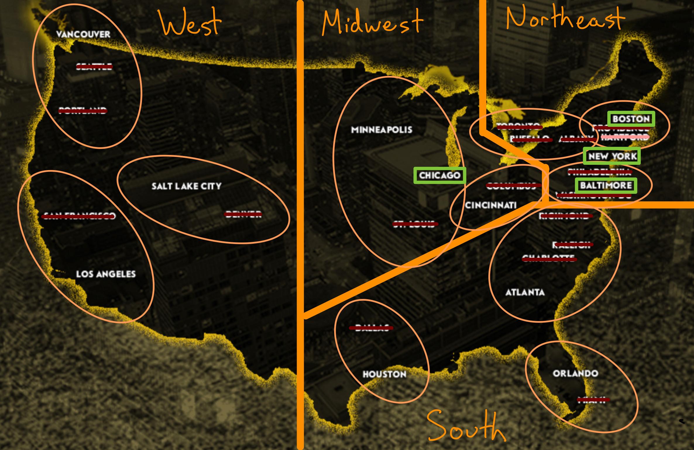

As of today, [Premier Lacrosse League (PLL) has named 4 of the 12 cities that will host games during their inaugural season](https://www.premierlacrosseleague.com/schedule). The PLL started with a list of 30 cities and in January, I posted what I thought would be [the ideal slate of 12 cities](https://www.alspur.com/picking-pll-cities/) for the new league. 

My initial selections started with the idea that the PLL should focus the bulk of their schedule in regions where youth lacrosse has the fastest growth rates. Now that the first four cities have been named, my picks are looking pretty good.

  
**Grading my proposal's accuracy after 4 cities: B+**
  
I nailed three out of the four: New York, Chicago, and Baltimore. I'll also give myself a half-point for Boston - while I thought that the PLL should pick one of the group of Boston/Hartford/Providence, my [Hartford homerism](https://www.trincoll.edu) weighed too heavily on my initial pick.

Here's what I'd like to see out of the next 8 PLL city announcements:

- 2 more "Midwest" region cities
- 3 "South" region cities
- 3 "West" region cities

I *really* think that the PLL should avoid picking any more "Northeast" region cities. If they're serious about increasing the exposure of the sport, they'll need [skate to where the puck is going, not to where it's been](https://en.wikipedia.org/wiki/Wayne_Gretzky). 