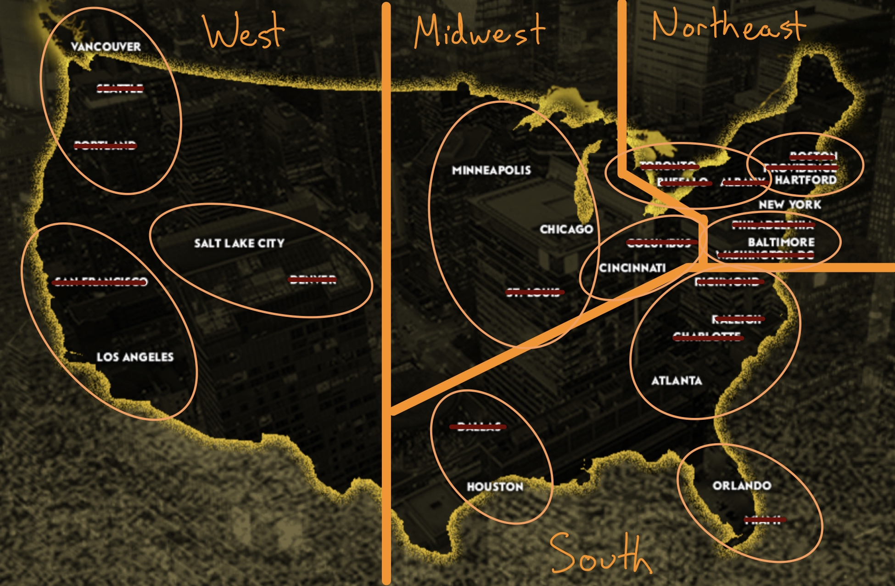

  
The [Premiere Lacrosse League (PLL)](https://www.premierlacrosseleague.com) is attempting a new model for a professional team sport: a tour-based schedule with the entire six-team league playing in a different city each weekend. Paired with their [NBC partnership](https://www.premierlacrosseleague.com/launch-announcement), more people will get to see high-quality lacrosse than a city-based league like the MLL could attain.

This week, the PLL announced a list of 30 cities that are in the running to be one of the 12 final sites for PLL games this summer. The map includes cities from coast-to-coast, as well as a pair of Canadian cities. Having grown up playing lacrosse in Minnesota and doing some coaching in Kentucky, I’m excited to see a lot of non-traditional lacrosse areas on the map. It seems clear that the PLL is serious about expanding interest in the game beyond the [Acela corridor](https://en.wikipedia.org/wiki/Northeast_Corridor).  

The big question - how should the PLL decide which cities to host game weekends during their inaugural season?
  
My proposal would be to divide the map into four regions, then to select three cities from each region. The four regions would be: Northeast, South, Midwest, and West. It would allow for representation in traditional hotbeds, but the bulk of the cities (75%) would be in areas where youth lacrosse has the highest rates of growth. 

Here’s my breakdown of each region: 
  
## Northeast
  
Cities: Albany, Baltimore, Boston, Buffalo, Hartford, New York, Philadelphia, Providence, Toronto, Washington DC

This region is rich with lacrosse tradition, which makes it difficult to cut any of these cities. I think right off the bat, New York has to be on the final list. Ignoring the media opportunities/exposure of the Big Apple, it would also give the league a chance to show the great work and impact of organizations working to expand access to the sport, such as [Harlem Lacrosse](https://www.harlemlacrosse.org).

With NYC off the table, that leaves us with two cities to select from three pretty distinct sub-regions:
  
- Mid-Atlantic: Baltimore, Philadelphia, and Washington DC
- New England: Boston, Hartford, Providence
- Upstate: Albany, Buffalo, Toronto

With all due respect to the Upstate cities, I think the remaining two cities should come from the other sub-regions. Baltimore is an easy pick here - it’s where PLL partner STX is headquartered and is home to some of the best lacrosse programs at every age level. 

Out of the New England sub-region, I’d go with a smaller city: Hartford. As a [Trinity alum](https://www.trincoll.edu) and former Hartford resident, I’m a little biased. *HOWEVER* - the UConn football stadium will be the site of a [men’s lacrosse NCAA quarterfinal game this spring as well as the 2021 and 2022 Men’s NCAA lacrosse championship games](http://dailycampus.com/stories/2017/4/19/hartford-to-host-2019-march-madness-rentchler-field-gets-2021-mens-lacrosse-title-game). Seems like a natural fit for the PLL!
  
**Final cities: Hartford, New York, Baltimore**
  
## South Region
  
Cities: Atlanta, Charlotte, Dallas, Houston, Miami, Orlando, Raleigh, Richmond

Let’s break these down into sub-regions again: 
  
- Old South: Atlanta, Charlotte, Raleigh, Richmond
- Florida: Miami, Orlando
- Texas: Dallas, Houston

I think both the Florida and Texas regions are a coin-flip, but the PLL really should have one city in each of these states. In the Old South, I’d lean towards Atlanta. If it’s good enough for the [SEC football championship game](https://en.wikipedia.org/wiki/SEC_Championship_Game), it ought to be good enough for the PLL.

**Final Cities: Atlanta, Houston, Orlando**
  
## Midwest
  
Cities: Chicago, Cincinnati, Columbus, Minneapolis, St. Louis

Minnesota and Ohio are the only states in this region with [more than 10,000 youth lacrosse participants](https://www.uslacrosse.org/sites/default/files/public/documents/about-us-lacrosse/participation-survey-2017.pdf), so they each get a weekend. In Ohio, I’ll give Cincinnati the nod solely because it’s a shorter drive from where I’m typing in Louisville. 

That leaves us with a choice between Chicago and St. Louis - the Second City makes sense here. 

**Final Cities: Chicago, Cincinnati, Minneapolis**
  
## West
  
The PLL headquarters are in Los Angeles, so it’s fairly obvious that it’ll be on the final list. Since I also think there ought to be a maximum of only one city per state, that rules out San Francisco.

This leaves two distinct areas: 
  
- Pacific Northwest: Portland, Seattle, Vancouver
- Mountains: Denver, Salt Lake City

I’m not super-familiar with the lacrosse scene in the Pacific Northwest, so let’s give it to the lone Canadian city. In the Mountains, I could see this going either way, but I’ll go with the home of the nation’s [newest DI men’s lacrosse program, Utah](https://utahutes.com/news/2017/6/15/general-utah-adds-mens-lacrosse-as-an-ncaa-sport.aspx).

**Final Cities: Los Angeles, Salt Lake City, Vancouver**

## Closing Thoughts

My choices are certainly not as thougthful as what the PLL will eventually decide, but it was a fun exercise. It will be interesting to see how the final sites are balanced between the four regions that I identified. It would be shocking if there were not three cities in both the West and the South, but I would not be shocked if there were only two in the Midwest and five in the Northeast. 

Regardless of the final outcome, I'm looking forward to the announcements of the final schedule, the teams, and most importantly, the first games in June.

  
  