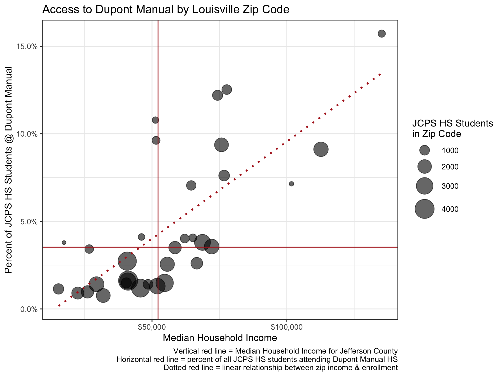
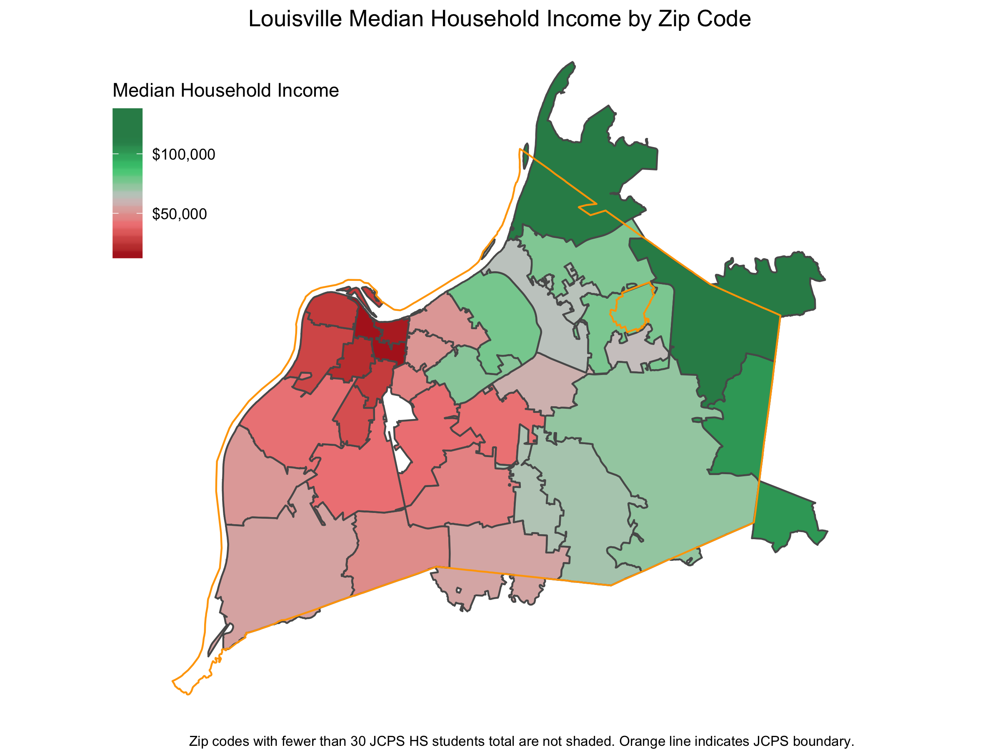
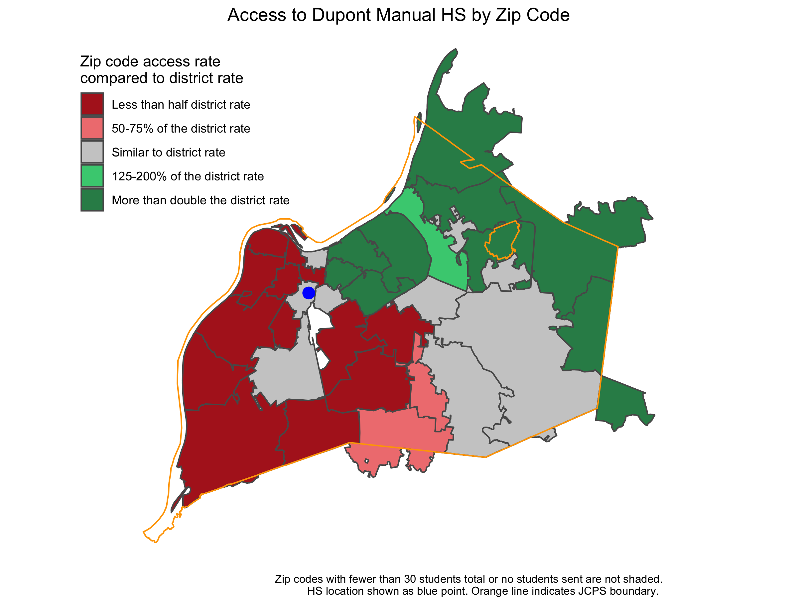

New York City’s selective high schools have a diversity problem:
  
> Though black and Hispanic students make up nearly 70 percent of New York City’s public school system as a whole, just over 10 percent of students admitted into the city’s eight specialized high schools were black or Hispanic, according to statistics released Monday by the city. That percentage is flat compared to last year.  

It’s also a problem in Louisville. 

DuPont Manual is [commonly](https://www.niche.com/k12/search/best-public-high-schools/s/kentucky/) [viewed](https://www.usnews.com/education/best-high-schools/kentucky) as the most desirable public high school Jefferson County. It’s a selective admissions school that accepts applications from students from all over the county and offers free transportation to those that are selected for admission. 

Yet in a district where 36% of students are African American, only 13% of Manual students are African American (the smallest percentage of any JCPS high school) and admission tends to favor students from the most affluent areas of Louisville. 

Using data from the [JCPS Data Book](https://www.jefferson.kyschools.us/node/1193) and the [US Census Bureau](https://factfinder.census.gov/faces/nav/jsf/pages/index.xhtml), we can see how a student’s home zip code correlates to the chance they will attend duPont Manual. Across all of JCPS, about 3.5% of high school students are enrolled at Manual, but that rate varies significantly by students’ resident zip code. 

In Jefferson County's seven most affluent zip codes, JCPS students are anywhere from **2 to 4.5 times more likely to enroll at Manual than the JCPS district average.** 

Those familiar with Louisville won’t be surprised with the income distribution across zip codes, shown in the map below.

But it’s revealing that the map above so closely mirrors the map below, which reflects the odds that a JCPS high school student in a given zip code is attending Manual. **In every zip code west of duPont Manual's campus, students are enrolling at Manual at less than half the district rate.** There are three zip codes in West Louisville with more than five thousand resident JCPS high school students, but only 46 students attend Manual - less than 1% of the resident students in these communities.

Unlike NYC, we don’t have publicly available data to further illustrate how many students have applied to Manual, where they live in Jefferson County, how many were qualified but not admitted, etc. But the [opaque admissions process at Manual](https://www.dupontmanual.com/magnetapp.html) does appear to favor families from communities with more financial resources. 

I don’t begrudge any family that currently sends or has sent students to Manual — it’s a great school and those parents have every right to seek out the best situation for their children. But a student’s educational opportunities shouldn’t be limited by the value of a home their parent(s) can afford. Louisville’s most selective public school, like NYC’s selective high schools, aren’t granting enough opportunities to the students who would stand to benefit the most from admission.

It’s why Kentucky should keep pushing to expand school choice. Low-income and African American families deserve the same opportunity to choose a great school for their child as a family in Anchorage or Prospect. 
