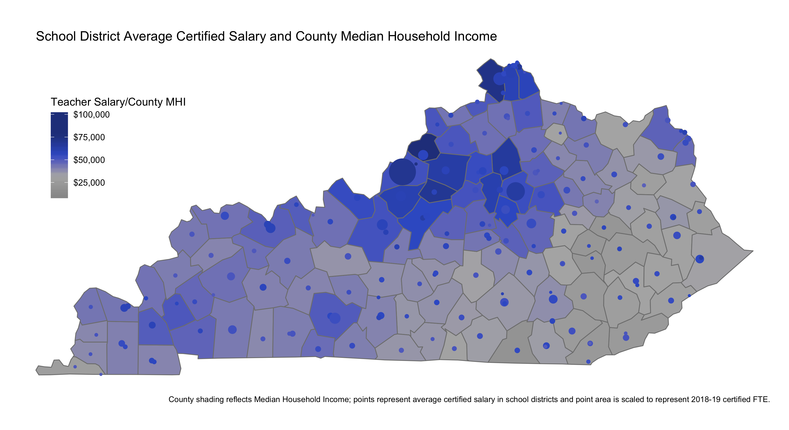
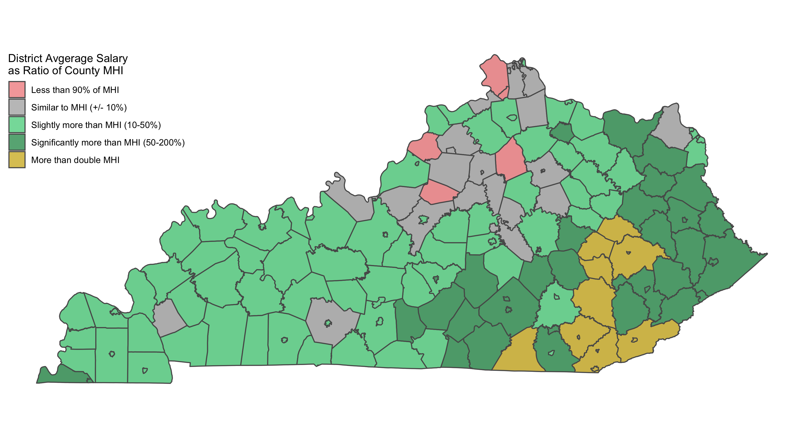

Do teachers in Kentucky earn more or less than the median household in the communities they serve?[^1]

The most recent data from the [American Community Survey](https://factfinder.census.gov/faces/nav/jsf/pages/index.xhtml) show that the Median Household Income (MHI) in Kentucky is $46,535. In the 2018-19 school year, [data from the Kentucky Department of Education](https://education.ky.gov/districts/FinRept/Pages/School%20District%20Personnel%20Information.aspx ) show that the average certified salary for Kentucky teachers was $57,819 - a difference of $11,284. However, household income and teacher salaries vary across communities in Kentucky. In most of the state, teachers earn more in salary than the median household, but there are communities where those dollar amounts are similar, and in a handful of the state's most affluent communities, teachers earn less than the median household's income.

In the state's largest district (Jefferson County), certified teachers in the 2018-19 school year earned $69,674 while the median household earned about $52,237 - a difference of $17,437. In neighboring Oldham County (the most affluent in the state) teachers earned an average of $56,118 in a community where the MHI is $92,273 - a difference of $36,155.

| Salary Category                         | Districts | FTE | % of Total FTE|
|:-----------------|-----:|-----:|------:|
| Less than 90% of MHI                     |   5 |   3,420 |    6.8% |
| Similar to MHI (+/- 10%)                 |   33|   9,021 |    17.8% |
| Slightly more than MHI (10-50%)          |   85|  29,352 |    58.0% |
| Significantly more than MHI (50-200%)    |   36|   6,823 |    13.5% |
| More than double MHI                     |   14|   1,982 |    3.9% |

There are only 4 counties in Kentucky where the average teacher's salary is less than 90% the county's MHI. These are also happen to be the counties with the highest MHI: Oldham, Boone, Spencer, and Scott. On the other end of the spectrum, there are 50 districts where teachers are earning at least 50% more than the median household in their counties, representing 17.4% of certified teacher FTEs. In the majority of districts, teachers representing 58% of certified FTEs earned 10-50% more than the MHI in their counties.

1 in 4 of Kentucky's certified teachers work in a district where the average salary is similar to or less than the MHI of their employer's county, which means **75% of certified teachers in Kentucky work in a district where the average salary is at least 10% more than the median household in the community they serve.**

Why does this matter? 

Kentucky has seen several days of teacher "sickouts" during this school year. These quasi-strikes were sparked in protest of changes to pension laws, proposed changes to a pension governing board, tax credit scholarship legislation, and a bill to change the process for hiring principals in Jefferson County. 

Setting aside the merits of these policies, it's important to consider the impact of "sickouts" on students and families. These disruptions to learning happen with little notice for parents/guardians to arrange childcare and for three quarters of the state, it's done by public employees who out-earn the median household in the community they serve. 

The [*raison d'etre*](https://en.wiktionary.org/wiki/raison_d%27être) for these school closures is often only tangentially connected to improving outcomes for kids. When it's led by professionals earning more - sometimes significantly more - than the families they serve, quasi-strikes of teachers may actually lead to *reduced* support for their policy goals. 

I'm a big fan of teachers - I was a public school teacher and my sister has made it her career. But I would urge Kentucky's teachers to consider the impact of school shutdowns on the kids and families they serve before further utilizing that tactic. The vast majority of homes in the communities they serve earn less than the average teacher and may not have the means to arrange childcare on short notice. Additionally, disrupting the learning process may be even more harmful for economically disadvantaged students. 

In the end, **students and families bear the costs of "sickouts" in Kentucky and the benefits to them are not very clear.** I'm not sure how many more school closures families will tolerate, but there is certainly a limit - I just hope that teachers don't push past it. 

[^1]: All code and data used to answer this question are [available on my GitHub page.](https://github.com/alspur/ky-mhi-teacher-salary)
