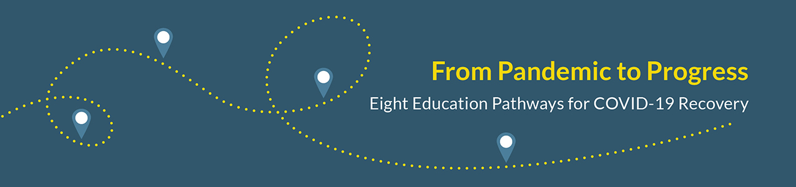

> In the wake of COVID-19, the development of multiple AP-like consortia aligned to different educational visions for grades K-12 could help foster quality, coherence, and pluralism across a diverse range of education providers.

The movement to empower families to exercise educational choice has yielded significant progress. Though the struggle to empower every parent to choose a great option for their kids is far from over, the [trend lines](https://nces.ed.gov/pubsearch/pubsinfo.asp?pubid=2019106) are [undeniable](https://fordhaminstitute.org/national/commentary/real-story-school-choice-working): More families are choosing how their children are educated than ever before. Much of this growth was the result of public policy change that expanded access to within- district choice options, public charter schools, and private school choice programs.

Families are also increasingly exploring more granular sub-schooling educational options, such as tutoring or online courses. The COVID-19 pandemic played a key role in accelerating this trend as families supplemented or replaced their children’s traditional schooling with [online providers](https://www.khanacademy.org) and [learning pods](https://www.crpe.org/current-research/learning-pods). The growth of these new options wasn’t the product of policy change — it was driven by the emergent preferences and needs of families.

In an increasingly diverse educational ecosystem — especially one driven by family demand rather than policy design — supporting quality and coherent options is a much more complex endeavor that calls for a more decentralized approach.

- [Download](https://bellwethereducation.org/sites/default/files/Bellwether_PandemictoProgress_ChoiceEcosystem_Final.pdf) the brief via Bellwether Education Partners
