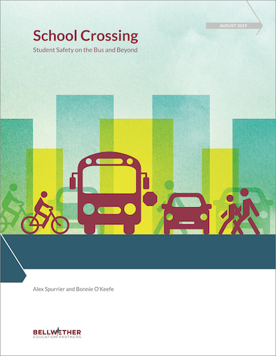

In 1969, more than half of students walked or biked to school, a little more than a third rode on a school bus, and relatively few rode to school in a car. Today, approximately a third of students still rely on a yellow bus, but only one out of 10 walk or bike, and more than half ride in a car. Students also live farther away from school, on average, than they used to, making school transportation logistics more complex. Cover of "School Crossing: Student Transportation Safety on the Bus and Beyond" by Bellwether Education Partners, August 2019

A school transportation system’s first responsibility must be student safety. And while the vast majority of students get to and from school safely each day, the kinds of risks and means to address them vary greatly based on how students get to school. Improving student transportation safety must recognize and address the diverse and changing picture of how students get to school. It will require a holistic approach, making the route to and from school safe for students on school buses, riding in cars, pedaling bikes, walking, or using public transit.

Schools and communities should consider questions about transportation safety beyond what they typically track. For example, how do students and families define a safe street? What are the pros and cons of increased traffic violation enforcement around schools? What role does school location play in encouraging safe school transportation?

In our new report, “School Crossing: Student Transportation Safety on the Bus and Beyond,” we examine historical changes in how students get to school and the safety concerns of each mode of student transportation. We present a menu of recommendations for how individual communities, whether rural or urban, can improve student transportation safety. Many of these actions require leadership from and collaboration among different parts of a school community, including families, school and district leaders, local governments, and state policymakers. 

- [Download](https://bellwethereducation.org/sites/default/files/Bellwether_WVPM-SchoolCrossing_FINAL.pdf) the full report via Bellwether Education.

